# 农产品销售系统

<div align="center">
<h1>企业级农产品销售系统</h1>
</div>


<div align="center">
一个基于若依框架的企业级农产品销售系统，采用前后端分离架构
</div>


## 📚 项目介绍

本项目是一个完整的企业级农产品销售系统，基于若依框架进行开发，采用现代化的技术栈和架构设计。系统提供完整的金融管理解决方案，包括前端管理界面和后端服务。

## 📋 项目结构

项目包含以下主要模块：

### 1. 后端项目结构

```
├── ruoyi-admin/          // 后台服务模块
├── ruoyi-common/         // 公共模块
├── ruoyi-modules/        // 业务模块
├── ruoyi-extend/         // 扩展模块
├── plus-ui-ts/          // 前端项目
├── Financing_python/     // Python相关模块
├── script/              // 脚本文件
├── pom.xml              // Maven项目配置
└── .gitignore           // Git忽略配置
```

### 2. 前端项目结构 (plus-ui-ts)

```
plus-ui-ts/
├── src/                 // 源代码目录
│   ├── api/            // API 接口
│   ├── assets/         // 静态资源
│   ├── components/     // 公共组件
│   ├── views/          // 页面视图
│   ├── router/         // 路由配置
│   ├── store/          // 状态管理
│   ├── utils/          // 工具函数
│   ├── types/          // TypeScript 类型定义
│   ├── layout/         // 布局组件
│   ├── lang/           // 国际化
│   ├── enums/          // 枚举定义
│   ├── hooks/          // Vue Hooks
│   ├── directive/      // 自定义指令
│   ├── plugins/        // 插件
│   ├── bpmn/           // 工作流相关
│   ├── App.vue         // 根组件
│   ├── main.ts         // 入口文件
│   ├── permission.ts   // 权限控制
│   └── settings.ts     // 项目配置
├── public/             // 公共资源
├── vite/              // Vite 配置
├── html/              // HTML 模板
├── bin/               // 脚本文件
├── .env.development   // 开发环境配置
├── .env.production    // 生产环境配置
├── vite.config.ts     // Vite 配置
├── tsconfig.json      // TypeScript 配置
├── package.json       // 项目依赖
└── README.md          // 项目说明
```

### 3. 文档目录

```
├── 项目运行教程.md       // 项目运行说明
├── 代码提交教程.md       // 代码提交指南
├── 代码拉取教程.md       // 代码拉取指南
└── 项目文档部分/         // 项目详细文档
```

## 🔨 技术栈

### 后端技术栈

-   **核心框架**

    -   Spring Boot
    -   Spring Security
    -   MyBatis Plus
    -   Redis

-   **数据库**

    -   MySQL
    -   Redis

-   **开发工具**
    -   Maven
    -   JDK 1.8+
    -   IntelliJ IDEA

### 前端技术栈

-   **核心框架**

    -   Vue 3
    -   TypeScript
    -   Element Plus

-   **开发工具**
    -   Node.js
    -   npm/pnpm

## 🚀 快速开始

### 环境要求

-   JDK 1.8+
-   Maven 3.6+
-   MySQL 5.7+
-   Redis 6.0+
-   Node.js 14+

### 开发环境启动

#### 1. 后端服务启动

```bash
# 克隆项目
git clone https://gitee.com/xingyiboy/financing_link-git

# 进入项目目录
cd financing_link

# 安装依赖
mvn clean install

# 启动后端服务
# 在IDE中运行 RuoYiApplication
```

#### 2. 前端项目启动

```bash
# 进入前端目录
cd plus-ui-ts

# 安装依赖
npm install

# 启动开发服务器
npm run dev
```

### 生产环境部署

#### 1. 后端部署

```bash
# 打包后端服务
mvn clean package -DskipTests

# 生成的jar包位于 target 目录下
# 运行jar包
java -jar ruoyi-admin.jar
```

#### 2. 前端部署

```bash
# 进入前端目录
cd plus-ui-ts

# 安装依赖
npm install

# 构建生产环境
npm run build

# 构建产物位于 dist 目录下
# 将dist目录下的文件部署到Web服务器
```

### 数据库配置

1. 创建数据库

```sql
CREATE DATABASE IF NOT EXISTS ruoyi DEFAULT CHARACTER SET utf8mb4 COLLATE utf8mb4_general_ci;
```

2. 导入数据库脚本

```bash
# 执行 sql/ruoyi.sql 文件
```

### Redis 配置

1. 安装 Redis 服务
2. 修改配置文件中的 Redis 连接信息
   - 后端配置：`ruoyi-admin/src/main/resources/application.yml`
   - 前端配置：`plus-ui-ts/.env.development` 或 `.env.production`

### 常见问题

1. 端口占用问题

   - 后端默认端口：8080
   - 前端默认端口：80
   - 如需修改，请修改相应配置文件

2. 数据库连接问题

   - 检查数据库服务是否启动
   - 检查数据库用户名密码是否正确
   - 检查数据库连接地址是否正确

3. Redis 连接问题
   - 检查 Redis 服务是否启动
   - 检查 Redis 密码是否正确
   - 检查 Redis 连接地址是否正确

## 🌟 主要功能

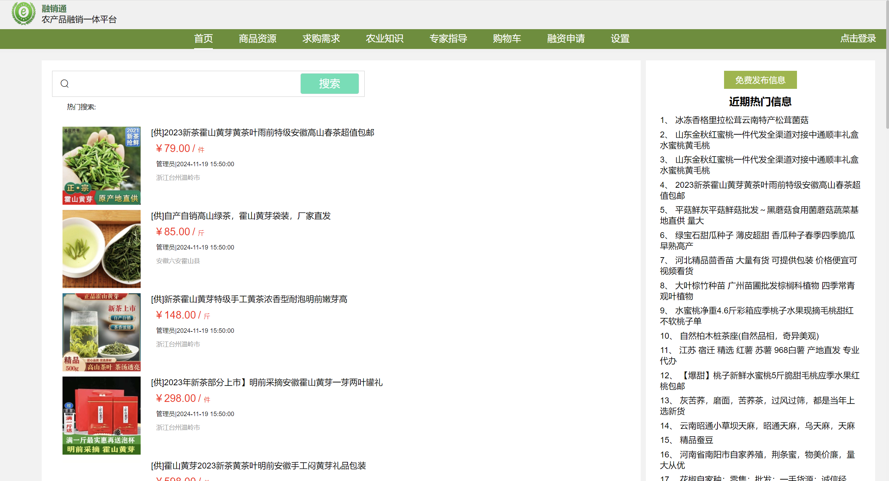


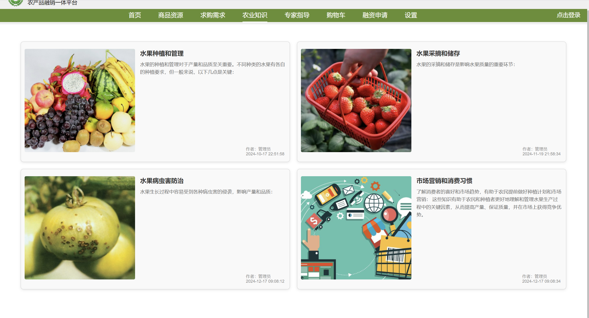


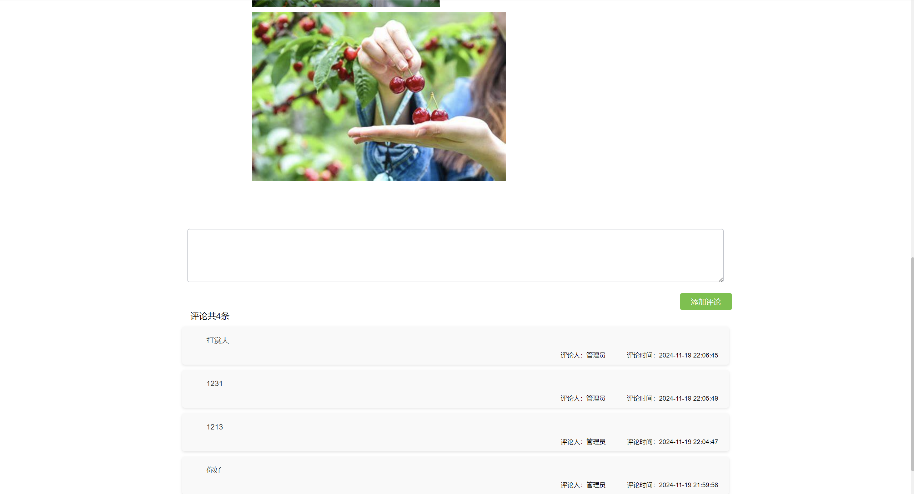

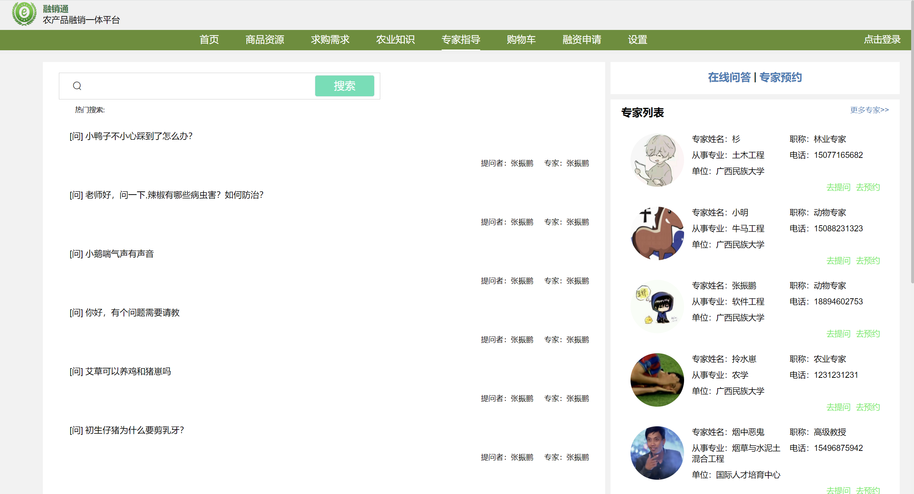

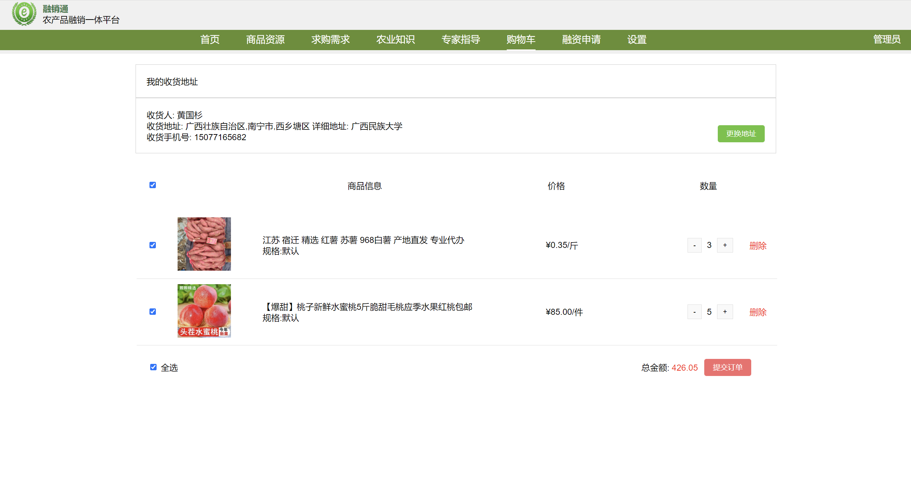

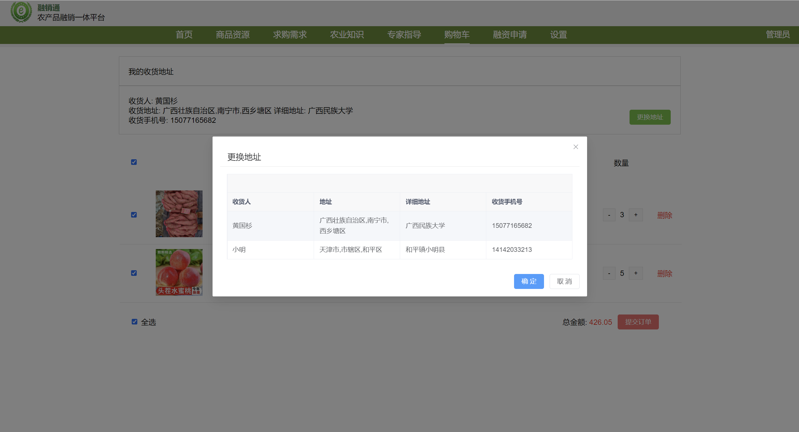

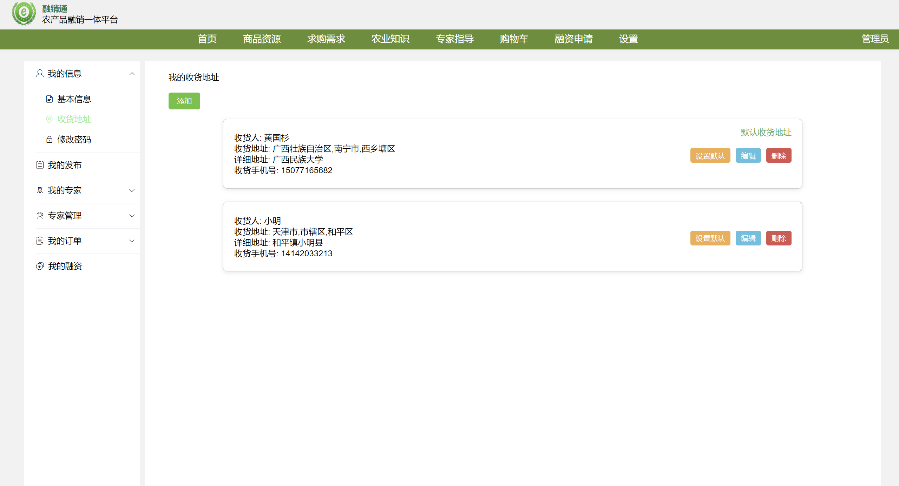

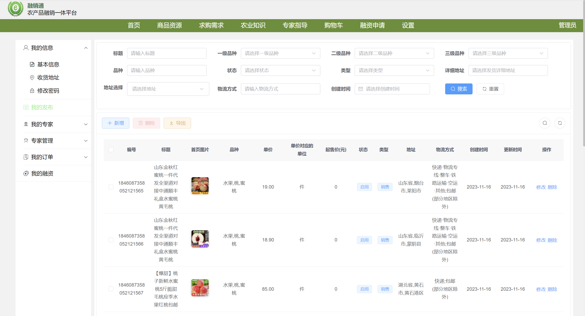

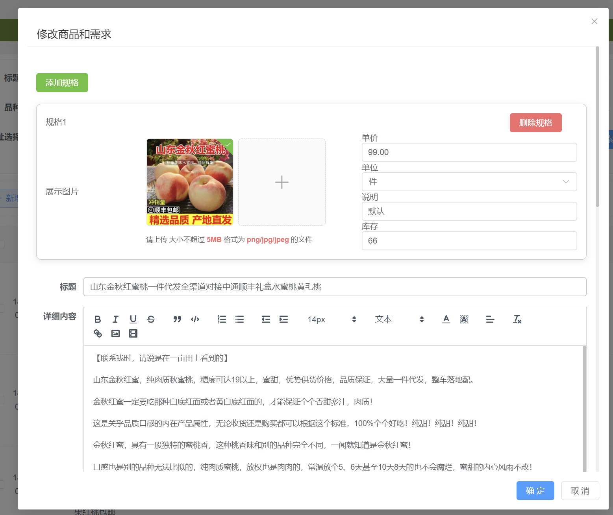


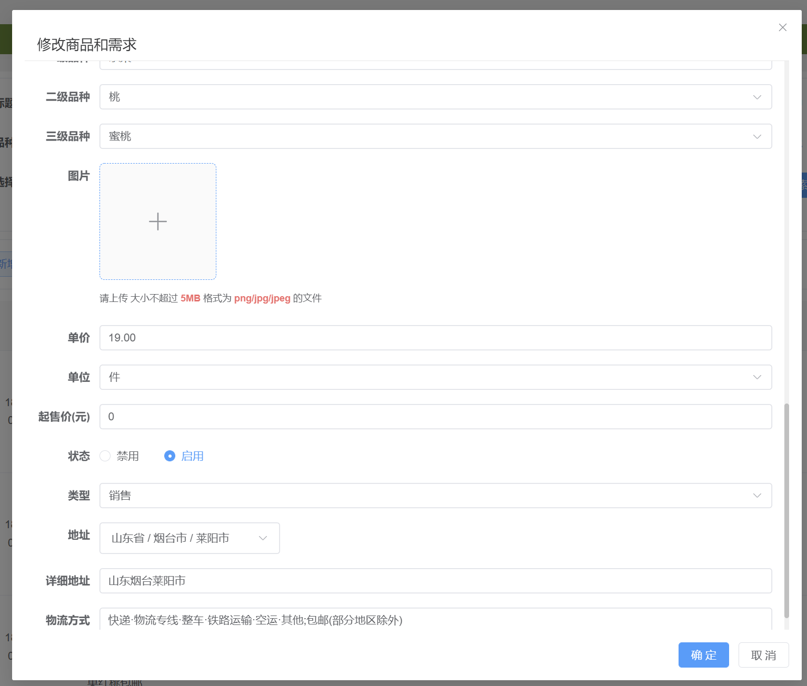


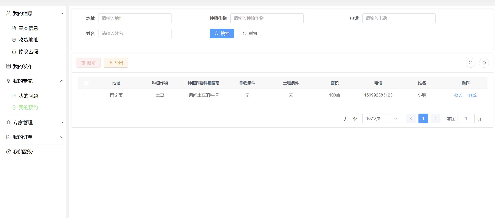

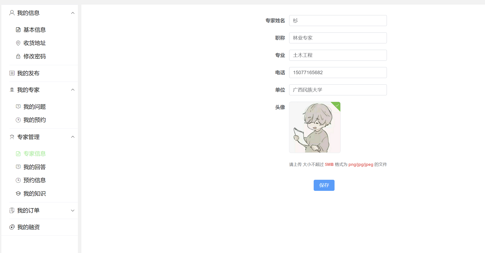


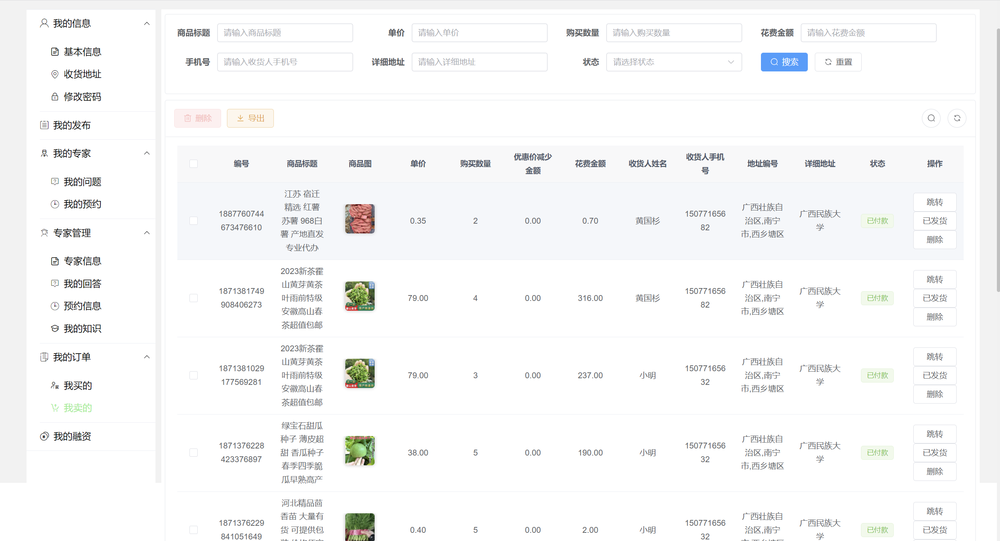


## 📖 文档说明

项目提供了详细的文档说明：

-   `项目运行教程.md`：包含项目运行的具体步骤
-   `代码提交教程.md`：包含代码提交的规范和流程
-   `代码拉取教程.md`：包含代码拉取的操作指南
-   `项目文档部分/`：包含项目的详细文档


## 👥 维护者

- [@xingyi](https://gitee.com/xingyiboy)

## 🙏 鸣谢

感谢所有为这个项目做出贡献的开发者！
